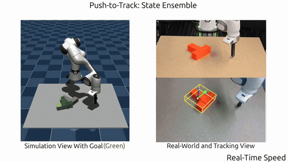
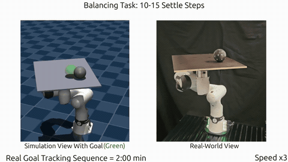
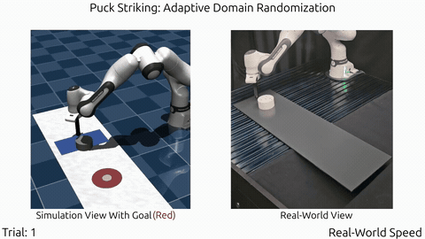

# BAMPC: Budget-Allocating Model Predictive Control

**Project page**: [https://bampc-framework.github.io/](https://bampc-framework.github.io/)

Code for the paper **Do My Samples Help? Compute Budget Allocation for Real-World Sampling-Based MPC in Contact-Rich Manipulation** (under review).

<p align="center">
  
  
  
</p>


Risk-aware sampling-based model predictive control on
[MuJoCo Warp](https://mujoco.readthedocs.io/en/latest/mjwarp/). Many control
samples are rolled out in parallel on the GPU across randomized physics
models (model uncertainty) and/or belief samples of the state (state
uncertainty). A risk strategy then aggregates their costs. Deployed
sim-to-real on a Franka FR3 via ROS 2.

Tasks: Push, Push-FR3, Balance, Balance-FR3, Peg-FR3, Flip-FR3, Curling-FR3.

## Contents

- [Installation](#installation)
- [Repository structure](#repository-structure)
- [Running examples](#running-examples)
- [Reproducing the experiments](#reproducing-the-experiments)
- [Implementing your own planner](#implementing-your-own-planner)
- [Implementing your own task](#implementing-your-own-task)

## Installation

Requires Linux, Python 3.10–3.12 and an NVIDIA GPU with a CUDA driver
(without one it falls back to slow eager replay).

```bash
git clone https://github.com/bampc-framework/bampc-code.git
cd bampc-code
uv sync                      # or: pip install -e .
uv sync --extra dev          # + ruff
```

Use an editable install from the source checkout. `configs/` and `models/`
are not shipped in the wheel, and the examples import `examples.*` from the
repo root. The ROS 2 nodes (`bampc/ros/`, `scripts/ros/`) need a
system ROS 2 install that provides `rclpy`.

## Repository structure

```
bampc/        the library
  task/               Task ABC + one module per task: MJCF, Warp cost kernels
  planner/            SamplingPlanner ABC + MPPI / PredictiveSampling / CEM
  rollout/            batched MJWarp rollout engine (CUDA-graph captured)
  risk.py             risk strategies: average, worst case, CVaR, VaR, ...
  dr/                 domain randomization of model fields
  uncertainty/        sensor noise, estimators, filters, belief clouds
  config/             loaders for the named profiles in configs/
  spline.py           control-knot interpolation
  allocation.py       switch a fixed budget between domains and samples
  belief.py           belief over a randomized parameter, from tracking error
  tracking.py         per-replan domain-prediction tracking
  sim/                interactive MuJoCo viewer driver
  ros/                real-robot planner / control nodes
configs/              named profiles: numerics, planner, reward, scenarios, noise
models/               MJCF assets and the block shape library (models/shapes/)
examples/             interactive examples (see below)
experiments/          config-driven sweeps behind the results (see below)
scripts/              probes, per-task tools, figures, ROS launchers (scripts/ros/)
```

The planner runs on the host in numpy. It drives a device rollout engine
that keeps every world's state on the GPU, so only an `(R, S)` cost tensor
(domains × samples) is copied back each step.

## Running examples

The examples are grouped by uncertainty regime, with one script per task:

```
examples/simple/<task>.py                 plain task (optional --mismatch)
examples/domain_randomization/<task>.py   + randomized models (--domains, --risk)
examples/state_uncertainty/<task>.py      + noisy sensor and belief (--estimator, --noise)
```

Each takes the algorithm (`mppi`, `ps` or `cem`) as its first argument:

```bash
uv run python examples/simple/push.py mppi
uv run python examples/domain_randomization/balance.py ps --risk cvar
uv run python examples/state_uncertainty/push_fr3.py ps --estimator ensemble
```

Each script's header docstring explains its setup and lists example
commands. `--help` shows every flag. Start states come from the frozen
scenario banks in `configs/scenarios/` (`--scenario <i>`). The top-level
modules in `examples/` (`flags.py`, `scenario.py`, ...) are shared CLI
helpers, not runnable examples.

## Reproducing the experiments

Every simulated result has a `run.sh` next to its config. It runs the sweep
and then draws its figures:

```bash
experiments/<task>/<axis>/<version>/run.sh smoke   # quick end-to-end check
experiments/<task>/<axis>/<version>/run.sh full    # the full run
experiments/scaling/run.sh full                    # planner wall-time benchmark
```

Run `push_fr3/state_uncertainty/t-ou/oracle-warmup50` before the other `t-ou`
cells, which reuse its oracle results. Data and figures go to each version's
`results/` (`results/smoke/` for a smoke run). Each axis is described in
`experiments/<axis>/README.md`.

## Implementing your own planner

Subclass `SamplingPlanner` (`bampc/planner/base.py`) and implement
two methods. `optimize` handles the rest: warm start, rollout, and risk
aggregation over domains.

```python
import numpy as np
from bampc.planner import SamplingParams, SamplingPlanner


class MyPlanner(SamplingPlanner):
    def __init__(self, task, engine, *, noise_level, **kwargs):
        super().__init__(task, engine, **kwargs)
        self.noise_level = noise_level

    def sample_knots(self, params):  # -> (num_samples, num_knots, nu)
        eps = self.rng.standard_normal(
            (self.num_samples, self.num_knots, self.task.nu)
        )
        return params.mean + self.noise_level * eps

    def update_params(self, params, sample_costs, knots):  # costs: (S,)
        return SamplingParams(tk=params.tk, mean=knots[np.argmin(sample_costs)])
```

Using it:

```python
engine = WarpRolloutEngine(task, num_samples=S, num_randomizations=R)
planner = MyPlanner(task, engine, risk_strategy=AverageCost(),
                    plan_horizon=1.0, num_samples=S, noise_level=0.3)
params = planner.init_params()
params, info = planner.optimize(StateSnapshot(qpos, qvel, time), params)
u = planner.get_action(params, t)
```

See `planner/mppi.py` for a complete reference. To select your planner by
name from a `PlannerConfig`, add a branch to `build_planner` in
`planner/config.py`.

## Implementing your own task

Subclass `Task` (`bampc/task/base.py`). A task compiles a MuJoCo
model and provides a cost kernel that runs on the GPU:

```python
import mujoco
import warp as wp
from bampc import MODELS_DIR
from bampc.task.base import ContactBudget, ModelConfig, Task


@wp.kernel
def _cost(sensordata: wp.array2d(dtype=wp.float32), scale: wp.float32,
          cost: wp.array(dtype=wp.float32)):
    w = wp.tid()
    ex, ey = sensordata[w, 0], sensordata[w, 1]
    cost[w] = cost[w] + scale * (ex * ex + ey * ey)


class _Cost:
    def accumulate(self, d, cost, scale):
        wp.launch(_cost, dim=cost.shape[0],
                  inputs=[d.sensordata, wp.float32(scale), cost])


class MyTask(Task):
    def __init__(self, model_config: ModelConfig | None = None):
        mj_model = mujoco.MjModel.from_xml_path(
            str(MODELS_DIR / "my_task" / "scene.xml")
        )
        super().__init__(mj_model, model_config=model_config,
                         contact_budget=ContactBudget())

    def build_cost_kernel(self):
        return _Cost()
```

The engine calls `accumulate` on every step with `scale = dt`. Optional
hooks:

- `build_terminal_cost_kernel()` adds a separate cost on the final state.
- `build_control_map_kernel()` and `control_map_host()` map a reduced
  sampling space to actuators, for example task-space velocity to joint
  velocity via IK.
- `object_pose_qpos` and `contact_probes` enable state uncertainty and
  contact tracking.

See `task/push.py` for the simplest complete task. Keep in mind:

- Run `scripts/probing/probe_task.py` to size the `ContactBudget`.
  An undersized budget silently drops contacts.
- Kernels run inside a captured CUDA graph. Update device arrays with
  `wp.copy` into the existing buffers and never reassign them.
- Put tuned solver settings, planner hyperparameters and start states in
  `configs/numerics/`, `configs/planner/` and `configs/scenarios/`.

## License

MIT, see [LICENSE](LICENSE).
